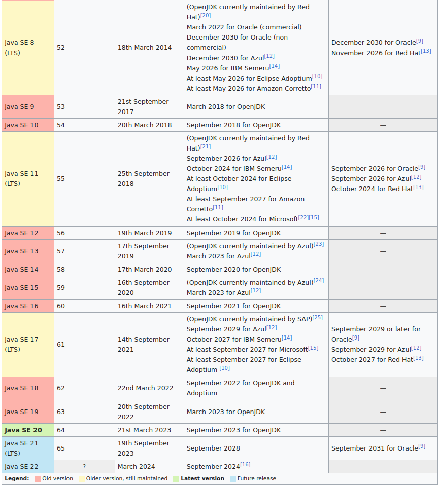

# Pensamento Computacional e Lógica de Programação

Nesta aula, abordaremos conceitos essenciais no mundo da programação. Começaremos com o "Pensamento Computacional", desenvolvendo habilidades analíticas para resolver problemas de forma estruturada. Em seguida, exploraremos a "Lógica de Programação", compreendendo a criação de algoritmos coesos. Além disso, teremos um primeiro contato com a história do Java, "Conhecendo a Linguagem de Programação Java", entendendo sua origem e evolução. Ao combinar esses elementos, você estará pronto para estabelecer bases sólidas em programação e criar soluções práticas e criativas.

## Pensamento Computacional

Usar o pensamento computacional é ver um desafio ou problema, refletir sobre ele, separá-lo em partes, resolver cada uma dessas partes da maneira mais lógica e assertiva, para daí sim chegar a um resultado final.

Dessa forma, podemos dividir o pensamento computacional em 4 pilares:

1.  **Abstração:** reconhecer o que é mais importante na situação-problema, para deixar de lado o que não for essencial;
2. **Decomposição**: dividir o seu desafio em problemas menores, para facilitar a sua compreensão;
3.  **Reconhecimento de padrão:** o que se assemelha no problema, quais as repetições e similaridades que ele tem e que podem auxiliar na sua resolução;
4.  **Algoritmo:** propõe uma ordem e sequência de passos para resolver o desafio ou problema.

## O que é Lógica de Programação?

A lógica de programação serve para traduzir os pensamentos humanos para o computador, já que os computadores funcionam através do código binário e não têm a mesma linha de raciocínio dos humanos. 

### Algoritimo

Os algoritmos fornecem uma abordagem sistemática e lógica para resolver problemas, garantindo que cada etapa seja claramente definida e possa ser executada em um número finito de passos. 

> **Descrição Narrativa**

É a forma mais simples e próxima da sua língua nativa para escrever um código. Funciona como instruções de *Como trocar uma làmpada*, com instruções detalhadas do passo a passo;

- Passo 1: *Certifique-se de que a lâmpada esteja desligada*: Antes de começar, verifique se a lâmpada está desligada. Se ela estava acesa, aguarde alguns minutos para que esfrie antes de prosseguir.
- Passo 2: *Desenrosque a lâmpada antiga*: Segure o suporte da lâmpada com uma mão e, com a outra mão, gire a lâmpada no sentido anti-horário para desenroscá-la do soquete. Remova-a cuidadosamente.
- Passo 3: *Coloque a nova lâmpada*: Com a lâmpada nova em mãos, insira-a no soquete e gire-a no sentido horário até que esteja bem fixa.
- Passo 4: *Ligue a lâmpada*: Após colocar a nova lâmpada, ligue-a para verificar se está funcionando corretamente.
- Passo 5: *Descarte a lâmpada antiga*: Lembre-se de descartar a lâmpada antiga de forma adequada, seguindo as normas de reciclagem ou descarte de resíduos eletrônicos da sua região.

Pronto! As intruções de "Como trocar uma lâmpada" pode ser considerada um algoritmo, já que ela segue uma sequência lógica de etapas para alcançar um objetivo. 

> **Fluxograma** 

É uma forma de mostrar o passo a passo de uma maneira mais visual, utilizando elementos gráficos;

 

<a href="https://brainly.com.br/tarefa/28463278">Figura 2: Fluxograma de Processos Simples: Como troca de lâmpada </a>

 

<a href="https://rockcontent.com/br/blog/fluxograma-de-processo/">Figura 3: Simbolos de um fluxograma de processos</a>

> **Pseudocódigo**

É a forma mais próxima de escrever um código que se assemelha a estrutura das linguagens de programação, como Java, Python e Javascript.

 

<a href="https://egua.tech/idegua/">Figura 4: Pseudocodigo - Linguagem de Programação Égua </a>

## Conhecendo a Linguagem de Programação Java

> **História da Linguagem de Programação Java**

- Java é uma linguagem de programação orientada a objetos desenvolvida na década de 90, na empresa Sun Microsystems e posteriormente adquirida pela Oracle em 2008.
- Desde seu lançamento, em maio de 1995, a plataforma Java foi adotada mais rapidamente do que qualquer outra linguagem de programação na história da computação.
- Tornou-se popular pelo seu uso na internet e está presente em navegadores, programas e jogos de computador, celular, calculadoras, e etc...

> **Características Pertinentes da Linguagem Java**

1. **Plataforma Independente (Write Once, Run Anywhere - WORA)**: O código Java é compilado em bytecode, que é executado na Máquina Virtual Java (JVM). Isso permite que os programas Java sejam executados em qualquer plataforma que tenha uma implementação da JVM, tornando-os altamente portáteis.
2. **Orientação a Objetos**: Java é uma linguagem totalmente orientada a objetos, o que significa que a programação é feita através da criação e interação entre objetos, promovendo reutilização e modularidade.
3. **Compilação e Interpretação**: O código-fonte Java é compilado em bytecode pela compilação, mas o bytecode é interpretado pela JVM. Isso combina a eficiência da compilação com a portabilidade da interpretação.
4. **Linguagem Moderna**: Java continua a evoluir com novos recursos e melhorias a cada versão, incorporando conceitos mais modernos de programação.
5. **Documentação Rica**: A documentação oficial do Java é extensa e bem organizada, com as especificações da linguagem e da API amplamente disponíveis.

> **Fases da Execução Java**

1. Escrevemos o seu código-fonte (arquivo com a extensão .java)
2. Utilizamos o JDK para compilar o seu código-fonte e gerar o arquivo bytecode (arquivo com a extensão .class)
3. Para executar o seu programa, a JVM lê o arquivo compilado (.class) e as bibliotecas padrões do Java que estão no JRE

 

<a href="https://blog.grancursosonline.com.br/java-compilacao-de-classes-java/">Figura 5: Fases de Execução Java</a>

- **JDK** (Java Development Kit) - é o Kit de Desenvolvimento Java responsável por compilar código-fonte (.java) em bytecode (.class)
- **JVM** (Java Virtual Machine) - é a Máquina Virtual do Java responsável por executar o bytecode (.class)
- **JRE** (Java Runtime Environment) - Ambiente de Execução do Java que fornece as bibliotecas padrões do Java para o JDK compilar o seu código e para a JVM executar o seu programa

> **Versões do Java**

- **OpenJDK:** é uma implementação de código aberto da plataforma Java. Ele é desenvolvido e mantido pela comunidade de desenvolvedores em colaboração com a Oracle e outras empresas. 
- **LTS (Long-Term Support):** As versões LTS recebem atualizações regulares de segurança e correções de bugs durante um período específico de tempo, normalmente vários anos.

 

<a href="https://en.wikipedia.org/wiki/Java_version_history">Figura 6: Versões do Java</a>

## Referências

[1] Brainly. "Desafio de Pensamento Computacional." Disponível em: https://brainly.com.br/tarefa/28463278.

[2] Rock Content. "Como criar um fluxograma de processo: guia completo." Disponível em: https://rockcontent.com/br/blog/fluxograma-de-processo/.

[3] Eguá Tech. "IDEgua - A IDE mais top!" Disponível em: https://egua.tech/idegua/.

[4] Gran Cursos Online. "Java: Entenda o que é a compilação de classes Java." Disponível em: https://blog.grancursosonline.com.br/java-compilacao-de-classes-java/.

[5] Wikipedia. "Java version history." Disponível em: https://en.wikipedia.org/wiki/Java_version_history.

[6] DIO - Digital Innovation One. "Dominando IDEs Java." Disponível em: https://web.dio.me/course/dominando-ides-java/learning/b0f1ae39-6af7-4a2c-8fc2-c73ae8463c84/?back=%2Fbrowse.

## Autor

 

Feito com ❤️ por <a href="https://www.instagram.com/camimi_la/" title="Instagram">Cami-la </a> 👋🏽 